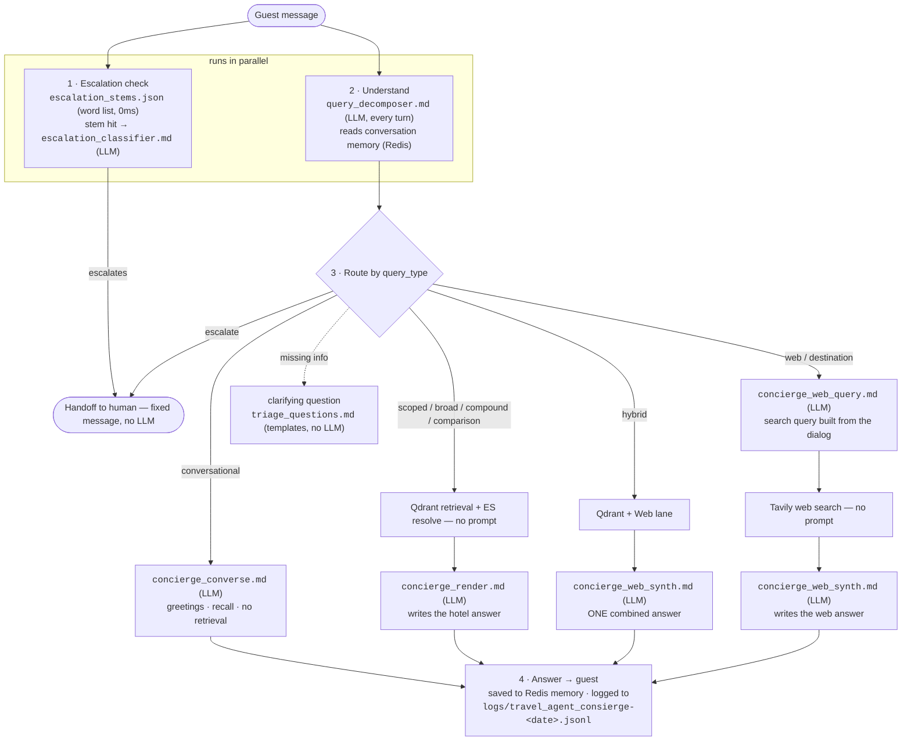

# Prompt flow — one guest turn through the concierge

Which prompt runs at each step of a dialog turn. All prompts live in
`src/voxtera/call_center/prompts/` and are editable live in **Admin → Prompt
Editor** (`/admin/call_center_prompts.html`) — saves hot-reload, no restart.

Special jumps (handled before routing):

- A bare **"yes"** after the bot offered to look something up → runs the web
  lane on the previous question (`pending_web_offer`).
- An explicit **"search online / internette ara"** → web lane on the previous
  question.

## Persona — one file, applied everywhere

`concierge_persona.md` holds WHO the assistant is (tone, no stock openers,
spoken format, language). It is **automatically prepended** to all three answer
writers (`concierge_render`, `concierge_web_synth`, `concierge_converse`) via
`_with_persona()` in `concierge.py`. Change the persona there once; the task
prompts contain only task rules.

## The prompts, one line each

| Prompt | Type | Fires when | Controls |
|---|---|---|---|
| `concierge_persona.md` | shared prefix | every answer | tone, openings, spoken format, language — the ONE place for character |
| `query_decomposer.md` | LLM (Haiku) | **every turn** | classification (hotel/destination/web/hybrid/escalate/conversational), hotel mention, region, requirements |
| `escalation_stems.json` | word list | every turn (0ms) | whether the escalation LLM even runs |
| `escalation_classifier.md` | LLM (nano) | only on a stem hit | human-handoff verdict (booking, cancel, complaint, medical, urgent) |
| `concierge_render.md` | LLM (Haiku) | hotel-KB answers | persona + grounding (no invented amenities/locations), offer-to-check-online |
| `concierge_web_query.md` | LLM (Haiku) | before any web search | one self-contained search query from the dialog (resolves "there"/"they") |
| `concierge_web_synth.md` | LLM (Haiku) | web + hybrid answers | persona, on-site vs arranged-nearby accuracy, destination format (options + one pick) |
| `concierge_converse.md` | LLM (Haiku) | conversational turns | answers from memory; forbidden to promise actions |
| `triage_questions.md` | templates | missing critical slot | localized clarifying questions |
| `concierge_decompose_legacy.md` | LLM | legacy endpoint only | not part of this flow |

LLM-call budget per turn: minimum 2 (decompose + one answer writer); a web
turn adds the query builder; an escalation-suspect turn adds the classifier.
