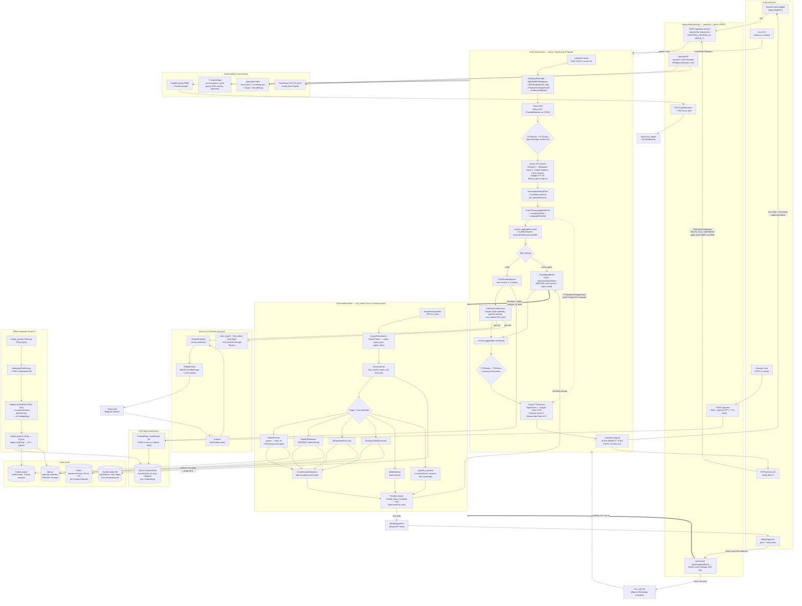
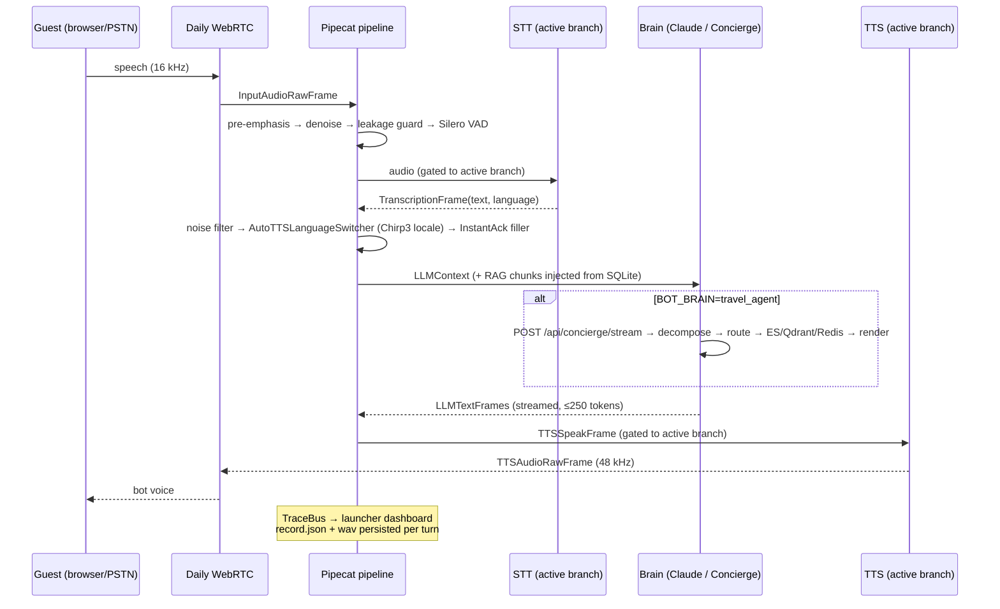

# Voxtera — Full System Data-Flow Diagram

Generated 2026-06-09 from the code in `src/`, `demo-hotel/`, and `scripts/`.

## 1. Full system diagram

## 2. One voice turn (sequence)

## 3. Key facts behind the arrows

- **Two brains** (`BOT_BRAIN`): `hotel` = in-process RAG (SQLite + e5) + Claude with tools; `travel_agent` = delegates each utterance to the ConciergePipeline over streaming NDJSON, same downstream frames so TTS/tracing are unchanged.
- **STT/TTS hot-swap**: in Daily mode all providers run as parallel gated branches; browser app-messages (`voxtera-stt`, `voxtera-tts-provider`) flip gates; Gladia lazy-connects to dodge the 1-session free-tier cap.
- **Language flow**: STT auto-detects → `AutoTTSLanguageSwitcher` rewrites the Chirp 3 HD voice id (`{locale}-Chirp3-HD-{character}`) mid-call; filler acks are language-matched.
- **WhatsApp text** shares the concierge with voice: `wa_id` is the session id, so Redis memory and region persist per contact. WhatsApp **calls** spawn a Pipecat call bot.
- **ConciergePipeline retrieval paths**: SCOPED (hotel KB), BROAD discovery, COMPOUND (multi-constraint), RESOLVE (name→hotel, 0.82 strong-score gate), WEB, and `conversational` (`_handle_converse`, answers from transcript, no retrieval).
- **LLM split**: escalation = GPT-4.1-nano; decompose/render/converse = Claude Haiku; voice bot = Claude (Haiku default) with prompt caching, 250-token cap.
- **Persistence**: atomic `record.json` + stereo WAV per call (`logs/calls/<sid>/`), JSONL conversation audit (`~/.voxtera/logs/`), Redis sessions (30 min TTL), MySQL leads (website-concierge).
- **Observability**: in-proc TraceBus → HTTP forward to `serve.py /api/bot-event` → SSE `trace.html`; per-bot TuneServer for live knob edits and injected speech.
